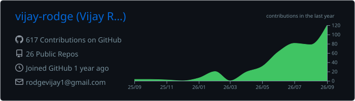

# Hi, I'm Vijay Rodge

*Computer Engineering Student | FullStack (MERN) Developer | Problem Solver | Tech Enthusiast*  

I’m a **Computer Engineering student** passionate about building impactful products. I specialize in **Frontend Development**, love solving **DSA problems**, and enjoy working on **AI, and EdTech projects**.  

My focus: *Bridging the gap between ideas and technology through scalable, user-friendly solutions.*  

  Pune, India &nbsp;|&nbsp;
  <a href="mailto:vijayrodge.dev@gmail.com">Email</a> &nbsp;|&nbsp;
  <a href="tel:+919028156972">+91 9028156972</a> &nbsp;|&nbsp;
  <a href="https://vijayrodge.is-a.dev" target="_blank">Portfolio</a> &nbsp;|&nbsp;
  <a href="https://linkedin.com/in/vijay-rodge" target="_blank">LinkedIn</a>

---

##  Tech Stack

### Languages

### Backend & Databases

### Frontend & UI

### Tools & Platforms

## Experience  

**GenAI Powered Data Analytics Job Simulation** *(April 2026 – Jun 2026)*  
- Exploratory data analysis and risk profiling 
- Business report and data storytelling for collections strategy
- Predicting delinquency with AI  
 
---

## Certifications  

- Git, GitLab, GitHub Fundamentals for Software Developers – Udemy *(Apr 2026)*  
- JavaScript Master Course From Beginner to Expert Developer – Udemy *(Sep 2025)*  
- Generative AI Literacy – IT-ITeS SSC NASSCOM *(Nov 2025)*  
- TCS iON Career Edge - AI Foundation – TCS iON *(Jul 2026)*  
- Data Structures and Algorithms using Java – infosys springboard *(April 2026)*  
- Software Engineering and Agile software development – infosys springboard *(Apr 2026)*  

---

## 📊 GitHub Stats

  

---

## 💻 Most Used Languages

  

---

⭐️ From [Vijay Rodge](https://github.com/vijay-rodge) 

 
